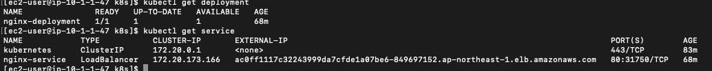
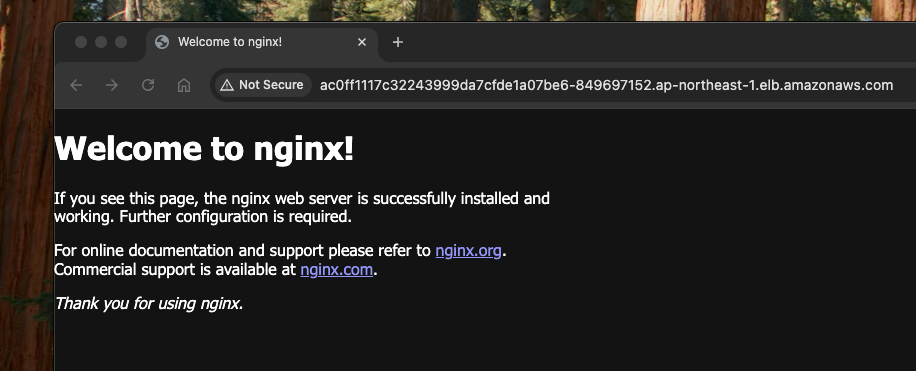

# Use EKS to Build Infra for web application

Currently, Kubernetes has been the mainstream in IT market over years, if anyone would like to build a robust and reliable product. Here is my study about EKS. 


## 📋 Prerequisites

- Minimum 2 CPUs/8GB RAM, but 4 CPUs+/16GB+ is recommended
- Terraform v1.9.8
- AWS admin acces (access key need to be configured by cmd 'aws configure --profile ${profile name}')

## 🏗️ Introduction


my idea is that a VPC contains 3 subnets with NAT gateway; the 1st subnet (with public IP) has bastion server, which can access other k8s clusters; 2nd and 3rd subnets host a k8s cluster respectively. RDS is built on its own but grant its access to k8s clusters only.

## ⚙️ Preparation

### 1. environment variable
In this demonstration, need to export some environment variables below:

```bash
export TF_VAR_rds_password="XXXX"
```
Look at the ${env}.tfvars, there is 'profile' property, it means your aws profile, put the access/secret key of this profile into environment variable

RSA key is for our bastion server access, have to create this ssh key before executing terraform scripts.

### 2. init terraform

I put sample terraform script in this study notes, before creating gke with terraform, have to initialise this project:
```bash
cd terrafrom
terraform init
```

## 🛠️ Build EKS cluster

### 1. run terraform, change your tfvars file

change variables in ${env}.tfvars, 
variable: '${env}' is needed when we install application into k8s cluster

```bash 
cd terraform
./runTerraform.sh dev                 
```

expected result:


output shows:<br/>
  1. bastion server ip
  2. role_arn, which associates to bastion ec2 IAM profile, we will need this to configure EKS API access 
  3. rds endpoint, private access within VPC only


### 2. configure Bastion Server access to EKS
```bash
ssh -i ${ssh_key} ${username}@${bastion public IP}
```
expected result: 


login to frontend cluster, we can find eks region from ${env}.tfvars:
```bash
aws eks --region ${region} update-kubeconfig --name ${cluster name}
#sample cmd:
aws eks --region ap-northeast-1 update-kubeconfig --name eks-dev28-backend-cluster
```
expected result:


When EKS cluster is created, the 'aws account' we use to run terraform (look at 'profile' in cloud_platform.tf) will be the default admin user. Based on my scripts, I associate an IAM role to bastion server, but how do we rely on bastion ec2 instance profile and access EKS without using access key and secret key? Here are the steps:

#### a. create awscli profile
```bash
aws configure 
```

```bash
then give access key --> 

AWS Access Key ID [None]: XXXXXXXXXX
AWS Secret Access Key [None]: XXXXXXXXXX
Default region name [None]: 
```

#### b. change kubectl configmap with aws-auth
```bash
aws eks --region ${region} update-kubeconfig --name ${cluster name}
kubectl edit configmap -n kube-system aws-auth
```
we can see configmap as below
```yaml
apiVersion: v1
data:
  mapRoles: |
    - groups:
      - system:bootstrappers
      - system:nodes
      rolearn: arn:aws:iam::${your aws account}:role/eks_workernode_policy
      username: system:node:{{EC2PrivateDNSName}}
  mapUsers: |
    - userarn: arn:aws:iam::123456789012:user/NewAdminUser
      username: new-admin-user
      groups:
      - system:masters
kind: ConfigMap
metadata:
  creationTimestamp: "2024-11-24T09:23:40Z"
  name: aws-auth
  namespace: kube-system
  resourceVersion: "2959"
  uid: f0b9a049-c45b-4149-811e-5af119b10d76
```

add new groups into mapRoles:
```yaml
apiVersion: v1
data:
  mapRoles: |
    - groups:
      - system:bootstrappers
      - system:nodes
      rolearn: arn:aws:iam::${your aws account}:role/eks_workernode_policy
      username: system:node:{{EC2PrivateDNSName}}
    - groups:
      - system:masters
      rolearn: arn:aws:iam::${your aws account}:role/ec2_access_eks-${env}
      username: bastion-server
  mapUsers: |
    - userarn: arn:aws:iam::123456789012:user/NewAdminUser
      username: new-admin-user
      groups:
      - system:masters
kind: ConfigMap
metadata:
  creationTimestamp: "2024-11-24T09:23:40Z"
  name: aws-auth
  namespace: kube-system
  resourceVersion: "2959"
  uid: f0b9a049-c45b-4149-811e-5af119b10d76
```
'rolearn' can be found from terrafrom output, and repeat it for other eks clusters if you have.

#### c. delete aws config and credential
```bash
sudo rm -rf ~/.aws/*
```
test connectivity:
```bash
kubectl cluster-info
kubectl get node
```
expected result:


### 3. deploy nginx and test EKS

copy all the yaml files under 'k8s' to bastion server,
test our frontend gke cluster, sign-in:
```bash 
aws eks --region ${region} update-kubeconfig --name ${cluster name}

cd k8s

kubectl apply -f nginx-configmap.yaml
kubectl apply -f nginx-deployment.yaml
kubectl apply -f nginx-lb.yaml
```
expected result:


there is an external ip (from the screenshot above), that is loab balancer IP, we can check result nginx webpage:


### . clean resource
```bash 
cd terraform
./deleteCluster.sh dev                 
```