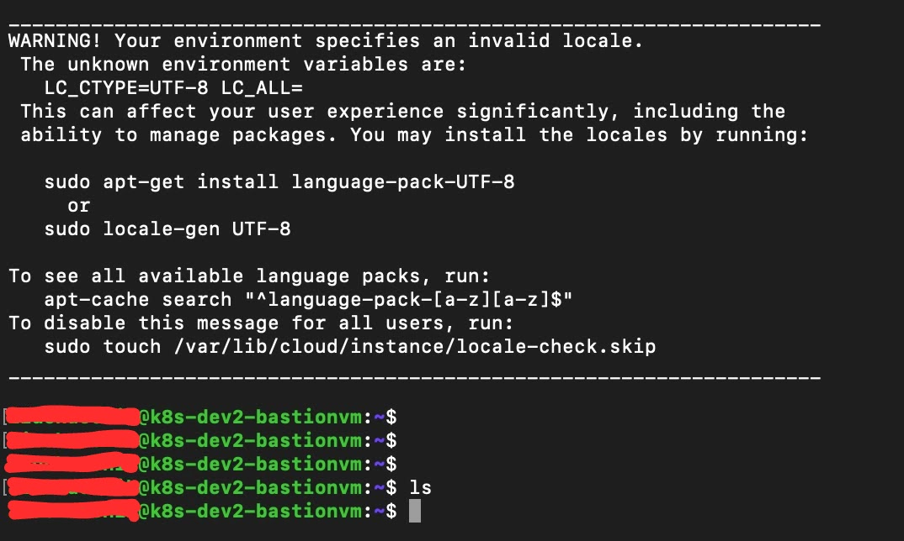

# Use GKE to Build Infra for web application

Currently, Kubernetes has been the mainstream in IT market over years, if anyone would like to build a robust and reliable product. Here is my study about GKE. 


## 📋 Prerequisites

- Minimum 2 CPUs/8GB RAM (GCP VM), but 4 CPUs+/16GB+ is recommended
- Terraform v1.9.8
- GCP admin acces
- Google Cloud SDK 501.0.0
- gcloud-crc32c 1.0.0

## 🏗️ Introduction

<!--  -->
<br/>

my idea is that a VPC contains 3 subnets with NAT gateway; the 1st subnet (with public IP) has bastion server, which can access other k8s clusters; 2nd and 3rd subnets host a k8s cluster respectively. Cloud SQL is built on its own but grant its access to k8s clusters only.

## ⚙️ Preparation

### 1. environment variable
In this demonstration, need to export some environment variables below:

```bash
export TF_VAR_project_id="XXXX"
export TF_VAR_sql_password="XXXX"
export TF_VAR_vm_access_key="your-username:ssh-rsa ......your-ssh-key..."
export TF_VAR_vm_ssh_username="your-username" 
```
RSA key is for our bastion server access, can be created with openssl, cmd looks like:
```bash
ssh-keygen -t rsa -b 2048 -f my-gcp-key -C "testuser"
```
### 2. init terraform

I put sample terraform script in this study notes, before creating gke with terraform, have to initialise this project:
```bash
cd terrafrom
terraform init
```
### 3. install gcloud sdk, open terminal and login
I don't create a service account and install credentials file into my local environment, 
so we need to run the cmd below and get access form terraform:
```bash
gcloud auth application-default login
gcloud auth login
```

## 🛠️ Build GKE cluster

### 1. run terraform, change your tfvars file

change variables in ${env}.tfvars, 
variable: '${env}' is needed when we install application into k8s cluster

```bash 
cd terraform
./runTerraform.sh dev                 
```

expected result: <br/>


### 2. test connectivity
```bash
ssh -i ${ssh_key} ${username}@${bastion public IP}
```
expected result: <br/> 
<!--  -->
<br/>

login to frontend cluster, we can find gke_location from ${env}.tfvars:
```bash
gcloud container clusters get-credentials ${frontend cluster name} --region ${gke_location} --project ${project id}

#sample cmd:
gcloud container clusters get-credentials frontend-dev-frontend-cluster --region asia-southeast1-a --project xxxxxx
```
expected result: <br/>


login to backend cluster, we can find gke_location from ${env}.tfvars:
```bash
gcloud container clusters get-credentials ${backend cluster name}  --region ${gke_location} --project ${project id}

#sample cmd:
gcloud container clusters get-credentials backend-dev2-private-cluster --region asia-southeast1-a --project xxxxxx
```
expected result: <br/>


gke cluster should look like:


cloudsql:


### 3. deploy nginx and test gke

copy all the yaml files under 'k8s' to bastion server,
test our frontend gke cluster, sign-in:
```bash 
gcloud container clusters get-credentials ${frontend cluster name} --region ${gke_location} --project ${project id}

cd k8s

kubectl apply -f nginx-configmap.yaml
kubectl apply -f nginx-deployment.yaml
kubectl apply -f nginx-lb.yaml
```
expected result: <br/>
<!--  -->
<br/>
there is an external ip (from the screenshot above), that is loab balancer IP, we can check result nginx webpage:<br/>
<!--  -->
<br/>

### . clean resource
```bash 
cd terraform
./deleteCluster.sh dev                 
```