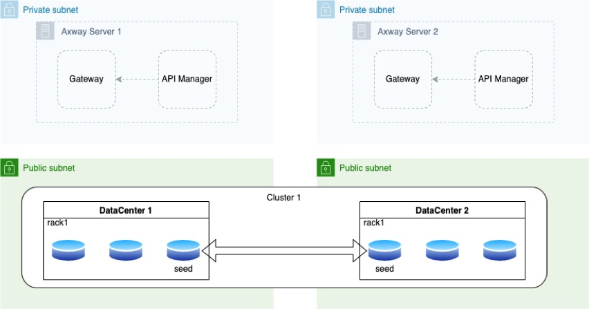
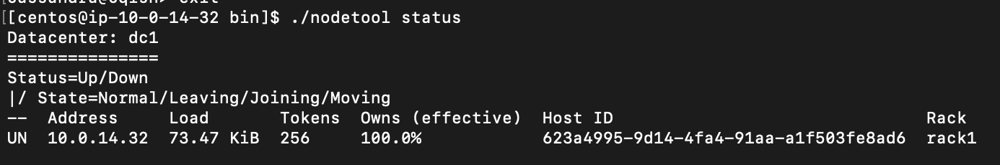
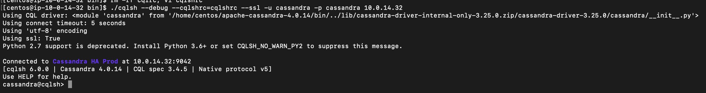
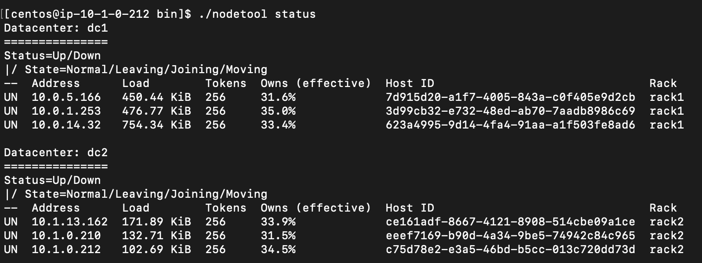
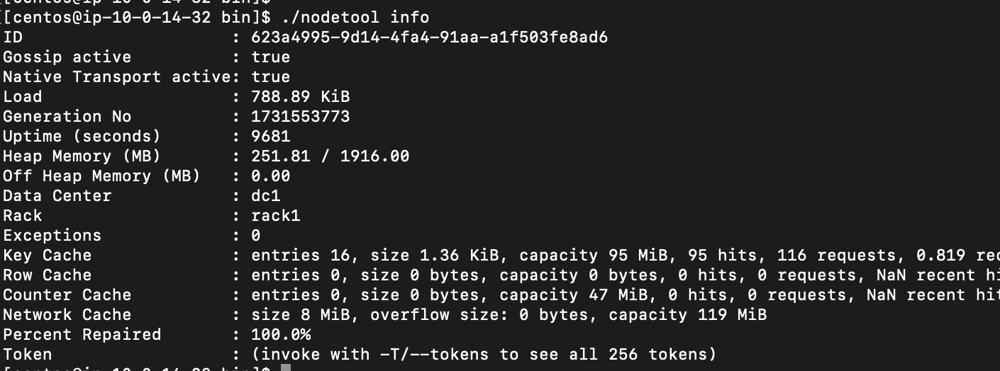

# Cassandra Multiple Datacenter Installation

I have been asked how to install cassandra multiple datacenter recently, here is what I have studied.

## 📋 Prerequisites

I use AWS for my studies, so the installation process may differ slightly if you’re using on-premises servers.

- Minimum 2 CPUs, 8GB RAM
- CentOS 7+
- openJDK 8
- Cassandra 4.0+
- 3 EC2 servers in 1st cluster, another 3 in 2nd cluster
- Use AWS Transit Gateway connecting 2 VPCs

## 🏗️ Introduction



I put all nodes into public subnet (with internet access), its easier to connect and install package, but all the nodes are connected via private IP. Private subnet should work if you have any security concern.

## ⚙️ Install Cassandra

```bash
curl -O https://dlcdn.apache.org/cassandra/4.0.14/apache-cassandra-4.0.14-bin.tar.gz

tar -xvzf apache-cassandra-4.0.14-bin.tar.gz
```

## 🛠️ Configuring Cassandra

### 1. prepared self-signed SSL cert

```bash
mkdir /home/centos/ssl_key
openssl genrsa -out server.pem 2048
openssl req -x509 -key server.pem -out server-ca.pem -days 3650
openssl pkcs12 -export -in server-ca.pem -inkey server.pem -out server.p12
```
remember the passcode when creating p12 file.

Create keyStore and copy to all Cassandra servers. Replace truststore_pass and keystore_pass below:

```bash
keytool -keystore /home/centos/apache-cassandra-4.0.14/conf/server-truststore.jks -importcert -file /home/centos/ssl_key/server-ca.pem -storepass{truststore_pass} -noprompt

keytool -importkeystore -deststorepass {keystore_pass} -destkeypass {keystore_pass} -destkeystore /home/centos/apache-cassandra-4.0.14/conf/server-keystore.jks -srckeystore /home/centos/ssl_key/server.p12 -srcstoretype PKCS12

keytool -keystore /home/centos/apache-cassandra-4.0.14/conf/server-keystore.jks -importcert -file /home/centos/ssl_key/server-ca.pem -storepass {keystore_pass} -noprompt

keytool -keystore /home/centos/apache-cassandra-4.0.14/conf/server-truststore.jks -importcert -file /home/centos/ssl_key/server-ca.pem -storepass 123456 -noprompt

keytool -importkeystore -deststorepass 123456 -destkeypass 123456 -destkeystore /home/centos/apache-cassandra-4.0.14/conf/server-keystore.jks -srckeystore /home/centos/ssl_key/server.p12 -srcstoretype PKCS12

keytool -keystore /home/centos/apache-cassandra-4.0.14/conf/server-keystore.jks -importcert -file /home/centos/ssl_key/server-ca.pem -storepass 123456 -noprompt
```
### 2. change cassandra.yaml

```bash
vi /home/centos/apache-cassandra-4.0.14/conf/cassandra.yaml
```

#### a. Here is the configuration for all nodes:

**cluster_name**: Cassandra HA {Env}<br/>
**seed_provider/parameters/seeds**: This must be the IP of seed provider, sequence of ip is important, seed provider IP of datacenter its own should be in the 1st place, e.g.:
DC1: 172.16.0.51:7000,172.16.20.51:7000 
DC2: 172.16.20.51:7000,172.16.0.51:7000<br/>
**num_tokens**: 256<br/>
**start_native_transport**: true<br/>
**native_transport_port**: 9042<br/>
**endpoint_snitch**: GossipingPropertyFileSnitch<br/>
**authenticator**: PasswordAuthenticator<br/>
**authorizer**: CassandraAuthorizer<br/>
**broadcast_address**: Leaving this blank will set it to the same value as listen_address<br/>
**rpc_address**: Leaving rpc_address blank has the same effect as on listen_address<br/>

#### the properties below are all under server_encryption_options:

**internode_encryption**: all<br/>
**require_client_auth**: true<br/>
**keystore**: /home/centos/apache-cassandra-4.0.14/conf/server-keystore.jks<br/>
**keystore_password**: 123456<br/>
**truststore**: /home/centos/apache-cassandra-4.0.14/conf/server-truststore.jks<br/>
**truststore_password**: 123456<br/>
**protocol**: TLS<br/>
**store_type**: JKS<br/>

#### b. Here is the configuration for individual nodes:
**listen_address**: {private IP of individual server}<br/>

### 3. change cassandra-rackdc.properties

```bash
vi /home/centos/apache-cassandra-4.0.14/conf/cassandra-rackdc.properties
```
**dc**: dc1 or dc2<br/>
**rack**: rack1<br/>
**prefer_local**: true<br/>

### 4. prepared self-signed SSL cert for client secured connection
#### a.
```bash
mkdir /home/centos/ssl_key
openssl genrsa -out client.pem 2048
openssl req -x509 -key client.pem -out client-ca.pem -days 3650
openssl pkcs12 -export -in client-ca.pem -inkey client.pem -out client.p12
```
remember the passcode when creating p12 file.

#### b. use the CA keypair in last step to sign the cert, this one is used by cqlsh (client tool)

```bash
openssl req -newkey rsa:2048 -nodes -keyout client_key.key -out signing_request.csr

openssl x509 -req -CA client-ca.pem -CAkey client.pem -in signing_request.csr -out client_cert.crt_signed -days 3650 -CAcreateserial
```

#### c. Install private key and self-signed cert in every cassandra node. Replace truststore_pass and keystore_pass below:

```bash
keytool -keystore /home/centos/apache-cassandra-4.0.14/conf/client-truststore.jks -importcert -file /home/centos/ssl_key/client-ca.pem -storepass{truststore_pass} -noprompt

keytool -importkeystore -deststorepass {keystore_pass} -destkeypass {keystore_pass} -destkeystore /home/centos/apache-cassandra-4.0.14/conf/client-keystore.jks -srckeystore /home/centos/ssl_key/client.p12 -srcstoretype PKCS12

keytool -keystore /home/centos/apache-cassandra-4.0.14/conf/client-keystore.jks -importcert -file /home/centos/ssl_key/client-ca.pem -storepass {keystore_pass} -noprompt

keytool -keystore /home/centos/apache-cassandra-4.0.14/conf/client-truststore.jks -importcert -file /home/centos/ssl_key/client-ca.pem -storepass 123456 -noprompt

keytool -importkeystore -deststorepass 123456 -destkeypass 123456 -destkeystore /home/centos/apache-cassandra-4.0.14/conf/client-keystore.jks -srckeystore /home/centos/ssl_key/client.p12 -srcstoretype PKCS12

keytool -keystore /home/centos/apache-cassandra-4.0.14/conf/client-keystore.jks -importcert -file /home/centos/ssl_key/client-ca.pem -storepass 123456 -noprompt
```
### 5. Configure client secured connection

```bash
vi /home/centos/apache-cassandra-4.0.14/conf/cassandra.yaml
```

#### a. Here is the config for all nodes, the properties below are all under client_encryption_options:

**enabled**: true<br/>
**optional**: false<br/>
**keystore**: /home/centos/apache-cassandra-4.0.14/conf/client-keystore.jks<br/>
**keystore_password**: 123456<br/>
**truststore**: /home/centos/apache-cassandra-4.0.14/conf/client-truststore.jks<br/>
**truststore_password**: 123456<br/>
**protocol**: TLS<br/>
**store_type**: JKS<br/>

### 6. Prepare cqlrc file

```bash
vi /home/centos/apache-cassandra-4.0.14/bin/cqlshrc
```

save the config below:

```bash
[connection]
hostname={the private ip of this machine}
port=9042
factory=cqlshlib.ssl.ssl_transport_factory
[ssl]
certfile=/<AppDir>/opay/ca/cassandra/conf/client-cert/client-ca.pem
userkey=/<AppDir>/opay/ca/cassandra/conf/client-cert/client_key.key
usercert=/<AppDir>/opay/ca/cassandra/conf/client-cert/client_cert.crt_signed
validate=false
[certfiles]
{the private ip of this machine}=/<AppDir>/opay/ca/cassandra/conf/client-cert/client_cert.crt_signed

[connection]
hostname=10.0.14.32
port=9042
factory=cqlshlib.ssl.ssl_transport_factory
[ssl]
certfile=/home/centos/ssl_key/client-ca.pem
userkey=/home/centos/ssl_key/client_key.key
usercert=/home/centos/ssl_key/client_cert.crt_signed
validate=false
[certfiles]
10.0.14.32=/home/centos/ssl_key/client_cert.crt_signed
```

### 7. Test Cassandra

start cassandra:
```bash
/home/centos/apache-cassandra-4.0.14/bin/cassandra -R
```
expected result:


test connectivity, the default username and password are all 'cassandra':
```bash
cd /home/centos/apache-cassandra-4.0.14/bin/

./cqlsh --debug --cqlshrc=cqlshrc --ssl -u {username} -p {password} {the ip of this machine}


cd /home/centos/apache-cassandra-4.0.14/bin/

./cqlsh --debug --cqlshrc=cqlshrc --ssl -u cassandra -p cassandra 10.0.14.32
```
if all configuration are correct, expected result:


### 8. Install other nodes
repeat steps from '1. prepared self-signed SSL cert' to '7. Test Cassandra'. You may consider to reuse server/client key/crt, rather than create new one. 

expected result:


### 9. Update Cassandra Auth Replication Factor

Use cql shell to update this table:
```bash
./cqlsh --debug --cqlshrc=cqlshrc --ssl -u cassandra -p {old-password} {the ip of this machine}

ALTER KEYSPACE "system_auth" WITH REPLICATION = { 'class': 'NetworkTopologyStrategy', '<dc1 name>': <number of dc1 node>, '<dc2 name>': <number of dc2 node> };
```
e.g.
```bash
ALTER KEYSPACE "system_auth" WITH REPLICATION = {'class' : 'NetworkTopologyStrategy', 'dc1' : 3, 'dc2' : 3};
```

exit cql shell and repair nodes:
```bash
./nodetool repair system_auth
./nodetool repair -full
```

after updating replication factor and repairing all nodes, run this cmd:
```bash
./nodetool info
```

expected result:

it shows the 100% 'Percent Repaired'

