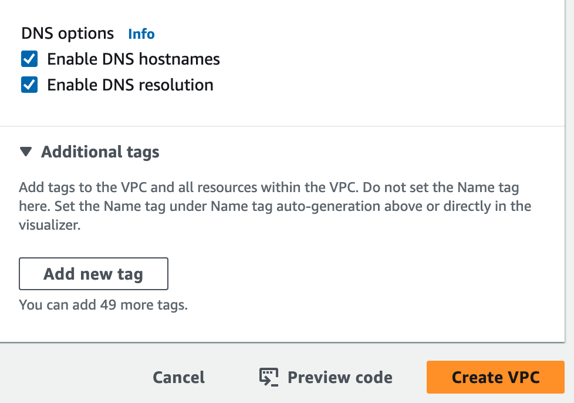
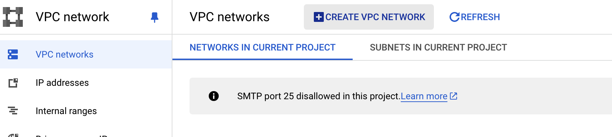
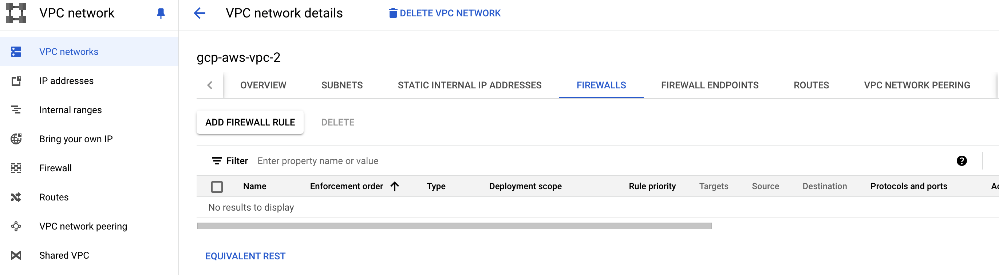
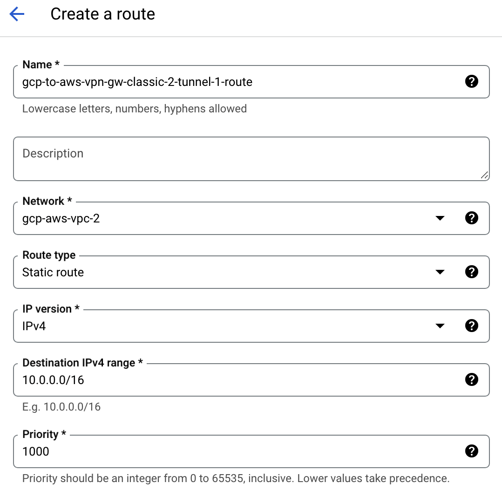

# Integrate AWS with GCP

Recently, a question came to me. What if a legacy system/service has been used over years and it is built on AWS/GCP, and company would like to explore another cloud platform, how do we integrate services across different cloud platforms. This note is going to study how to build site-to-site VPN between AWS and GCP.  

## 📋 Prerequisites

The AWS services in this document include Customer Gateway, VPC, VPN, Transit Gateway, EC2(for test), and required GCP services include VM (for test), VPC, Cloud VPN, Firewall, and Reserved external IP. To save time, I just use admmin access for both platform. 

- AWS admin access
- GCP admin access

## 🏗️ Introduction

From diagram above, what I would like to do is ec2/vm can ping each other, traffic goes from transit gateway, site-to-site vpn with customer gateway, to cloud vpn, and finally reach vm, and vice versa. Tasks are below:

  1. Reserve a static IP in GCP
  2. Create AWS VPC
  3. Create AWS Customer Gateway
  4. Create AWS Transit Gateway
  5. Create AWS Transit Gateway Attachment
  6. Create AWS Site-To-Site VPN
  7. Create AWS EC2
  8. Config route table of subnet
  9. Config Transit Gateway route table
  10. Create GCP VPC
  11. Create/Config Cloud VPN 
  12. Create GCP VM
  13. Config Network Firewall rule on GCP

finally, we can try to ping.

## ⚙️ Reserve GCP External IP

When I created customer gateway on AWS, it requires an external ip as entry point, but GCP cloud VPN is easier, it can config AWS public IP while creating service, so we have to start from reserving an external IP

#### 1. from GCP console, find VPC, find 'IP Address' from menu on the left-hand side, and click the button 'Reserve External Static IP Address' on the top

## ⚙️ Create Resources on AWS

#### 2. AWS VPC

Create new VPC on AWS, we need a public subnet, with internet access, easier to ssh into EC2 server. My VPC config looks like:

<!-- 

 -->
 
 
 

### 3. AWS Customer Gateway

From VPC page, can find 'Customer gateways' from menu on left-hand side, click button 'Create customer gateway' on the top-right corner

here is my customer gateway config, the value of 'IP address' should be the reserved IP from GCP 
<!--  -->
 

### 4. AWS Transit Gateway

From VPC page, can find 'Transit gateways' from menu on left-hand side, click button 'Create transit gateway' on the top-right corner

here is my transit gateway config, I only use default values except Name tag 
<!-- 
 -->
 
 

and it may take a few minutes to finish.

### 5. AWS Transit Gateway Attachment

Under 'Transit gateways' on the left side menu, 'Transit gateway attachment' can be found easily. Here is my attachment config, I associate new VPC/Subnet from step 1 to TGW. 

<!-- 

 -->
 
 
 

### 6. AWS Site-To-Site VPN

From VPC page, can find 'Site-to-Site VPN Connections' from menu on left-hand side, click button 'Create VPN connection' on the top-right corner

Remember choose the transit gateway and VPC created in previous steps: 

<!--  -->
 

'Local IPv4', in this case, is the CIDR of GCP VPC, 'Remote IPv4' means the CIDR of AWS VPC  
<!-- 
 -->
 
 

expected result:  
<!--  -->
 

There are 2 tunnels on the bottom, status are all 'Down', it is correct, because we haven't created GCP cloud VPN yet. Also keep the 2 'Outside IP address', we will use them to config cloud VPN tunnel. 

Don't forget to download tunnel config, there is the button on the top-right corner: 
<!--  -->
 

The counterpart is GCP, we choose 'Generic' for Vendor and platform, but 'ike2' in IKE version.

Look at the field 'Pre-Shared Key', we will need this value later. Find another pre-shared key!! we have 2 tunnels!!

### 7. AWS EC2

I don't give entire config to create EC2 server, only show network:

<!-- 
 -->
 
 

Public IP just make my access to ec2 easiler, if you have baston server or client VPN, you can put this ec2 server in private subnet or without public IP.

Security group, I purposedly grant all traffic access to CIDR '11.0.0.0/16', which is GCP VPC/Subnet

### 8. Route Table of Subnet

Check subnet route table: 
<!--  -->
 

if there is no '11.0.0.0/16' (CIDR of GCP VPC), edit route table: 
<!--  -->
 

Target should be 'Transit Gateway', and value is the id of new tgw created just now.

### 9. Transit Gateway Route Table

Check tgw route associates: 
<!--  -->
 

this route association should have 2 attachments, 1 is VPC, another is our site-to-site VPN.

Check tgw route table, click tab 'Routes':
the complete route table should be: 

if it doesn't, create a new route connecting to VPN: 
<!--  -->
 

## ⚙️ Create Resources on GCP

### 10. GCP VPC

Click 'Create VPC Network' on the top

here are my config: 
<!-- 

 -->
 
 
 
 
 

### 11. Cloud VPN

Search 'VPN', let's start from 'Cloud VPN Gateway'

This case only demonstrates 'Static Routing', not dynamic routing, use 'Classic VPN' 

Choose correct VPC in 'Network', use reserved IP address in 'IP address' 
<!--  -->
 

we can find 'Remote peer IP address' from AWS VPN tunnel detail, we have 2 tunnels!! 
<!-- 
 -->
 
 

once its done, go back AWS VPN, we should see the result:

the status is 'UP'

### 12. GCP VM

Search 'VM', and click button 'Create Instance'

I don't give all details of gcp VM config, just show network detail, choose the GCP VPC created in previous step: 
<!--  -->
 

### 13. Network Firewall/Route on GCP

1st rule is open ssh (port 22)

<!-- 

 -->
 
 
 

2nd rule is accept all traffic from '10.0.0.0/16', which is AWS VPC 
<!-- 
 -->
 
 

after creating gcp VPN and tunnels, routes should be added automatically, it should look like:

if it doesn't show, may need to fix it manually:
create routes, click tab 'Route', and click the hyperlink 'route management'

and create route here: 

Here is the detail of route config: 
<!-- 
 -->
 
 

we have 2 tunnel!!, don't forget do it again for 2nd tunnel.

## 🎆 Test Connectivity

SSH into AWS ec2 and GCP vm, ping each other!!
