# Use AWS site-to-site VPN and connect to on-premise resource

Nowadays companies have several legacy systems, for various reasons, they cannot be migrated to cloud. I have encountered a few similar requests in projects. This document is going to study how to use Transit gateway and site-to-site VPN connecting to on-premise VPN.   

## 📋 Prerequisites

I install strongswan on GCP vm to simulate this scenario. 

- AWS admin access
- Install and config strongswan on GCP, refer to this <a href="https://github.com/ChaoChihLiu/study_nodes/tree/main/network/strongswan">document</a>
- AWS VPC CIDR: 172.31.0.0/16
- On-premise CIDR: 10.0.0.0/8

## 🏗️ Introduction
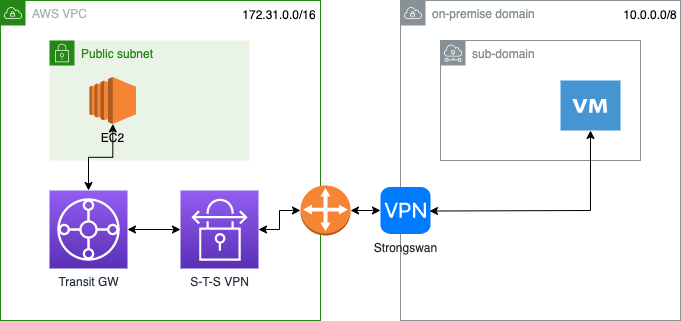

Idea is to create customer gateway, site-to-site vpn and transit gateway to provide connectivity between AWS and on-premise server.

## ⚙️ Create simulation on GCP

Kindly refer to <a href="https://github.com/ChaoChihLiu/study_nodes/tree/main/network/strongswan">this document</a>

## ⚙️ Create Resources on AWS

### 1. AWS Customer Gateway

here is my customer gateway config, the value of 'IP address' should be the public IP of strongswan server
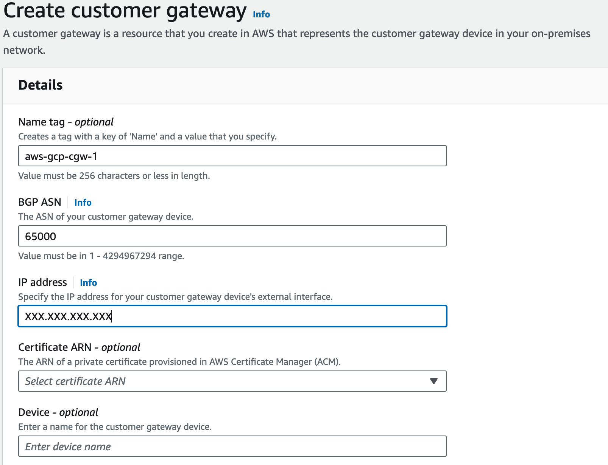

### 2. AWS Transit Gateway

here is my transit gateway config, I only use default values except Name tag
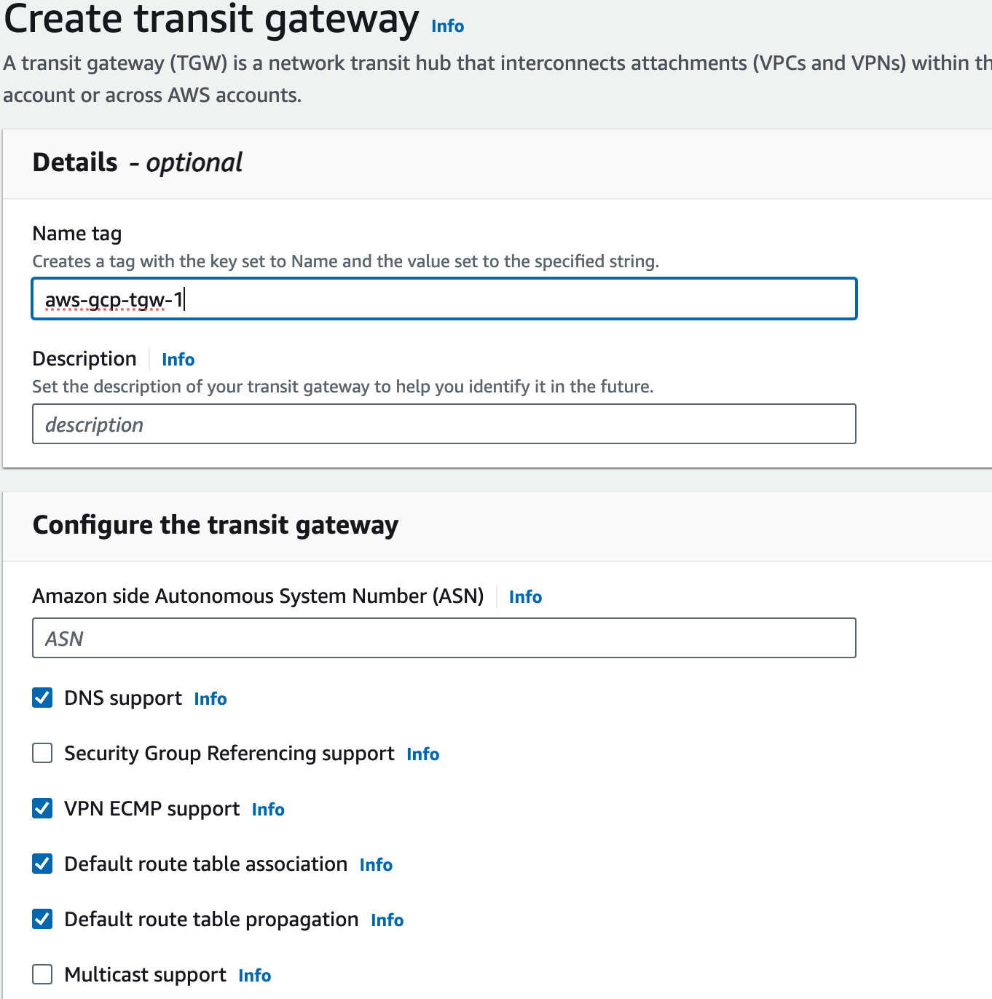
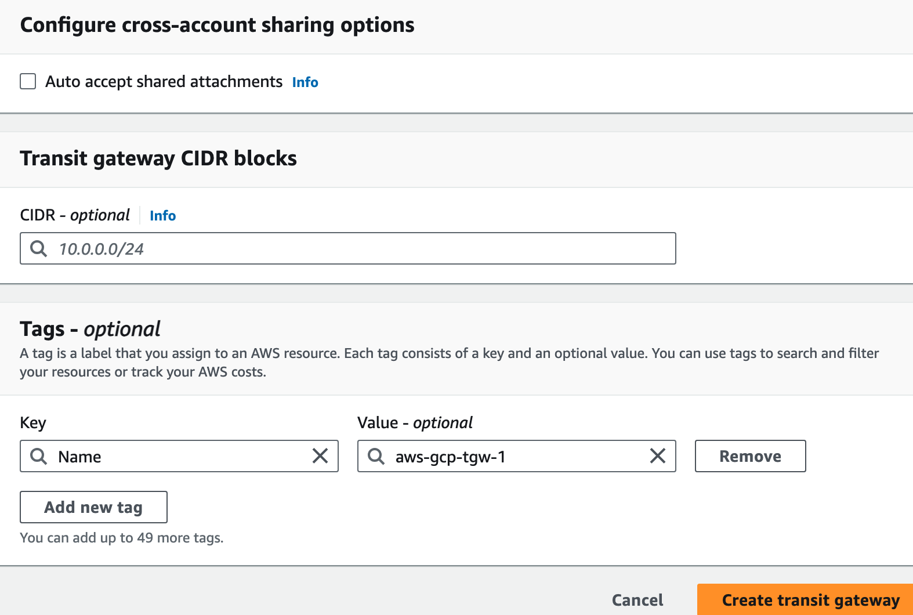
and it may take a few minutes to finish.

### 3. AWS Transit Gateway Attachment and Site-to-Site VPN

Under 'Transit gateways' on the left side menu, 'Transit gateway attachment' can be found easily. Here is my attachment config, I associate new VPC/Subnet from step 1 to TGW.

Here is the VPC attachment config:
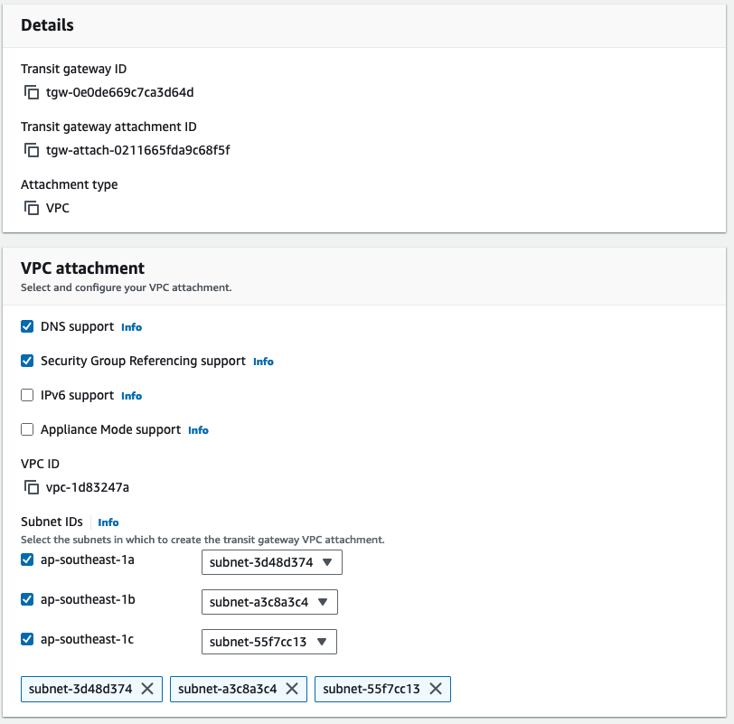
Here is the VPN attachment config: 
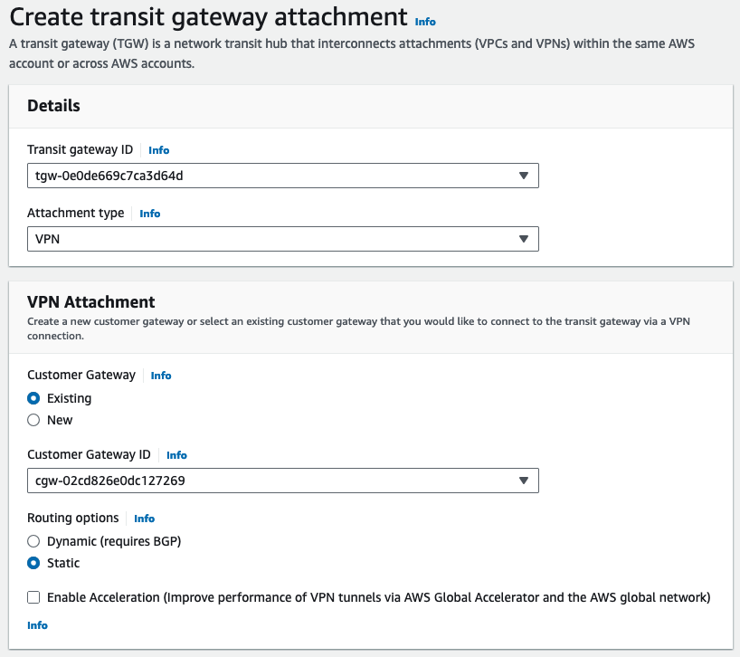
remember associate the customer gateway, created in previous step, to this attachment.

Also, site-to-site vpn will be created for you. 
expected result:
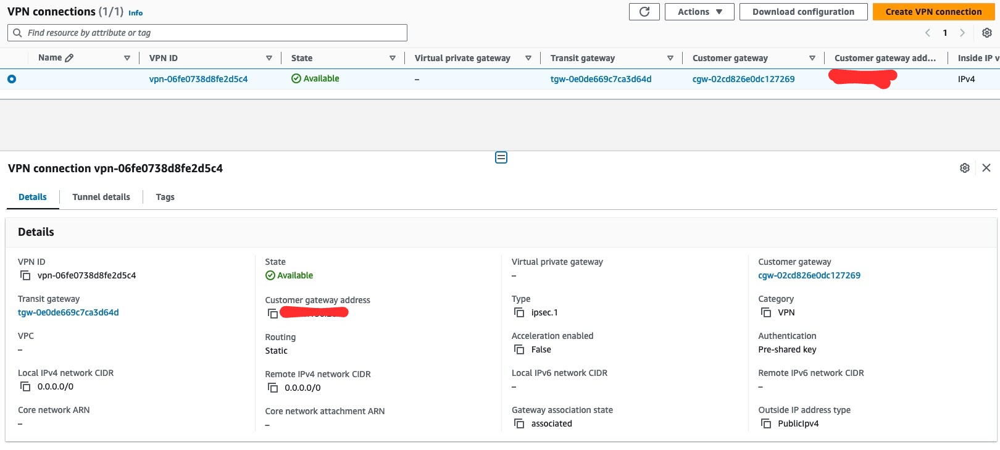

There is a 'Download' button on the top-right corner, download respective config to config strongswan:

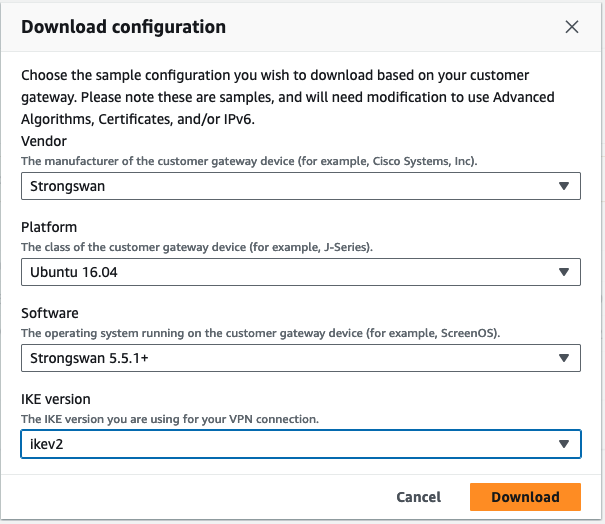

Once strongswan on GCP has been created and run successfully, after few minutes, the tunnel information should be 'up'.In this case, we only use tunnel 1.

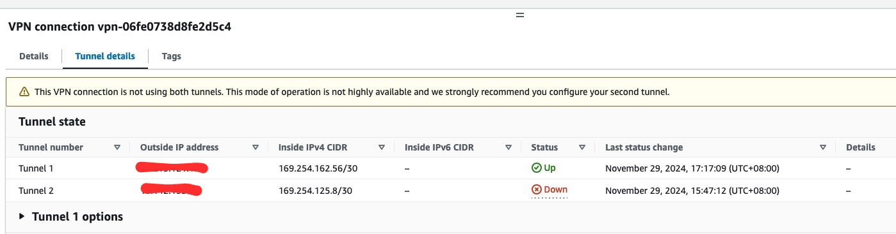

### 4. Route Table of VPC
I changed VPN route table, it will be applied to associated subnets if subnets has no its own route table. 

Check bpc route table:
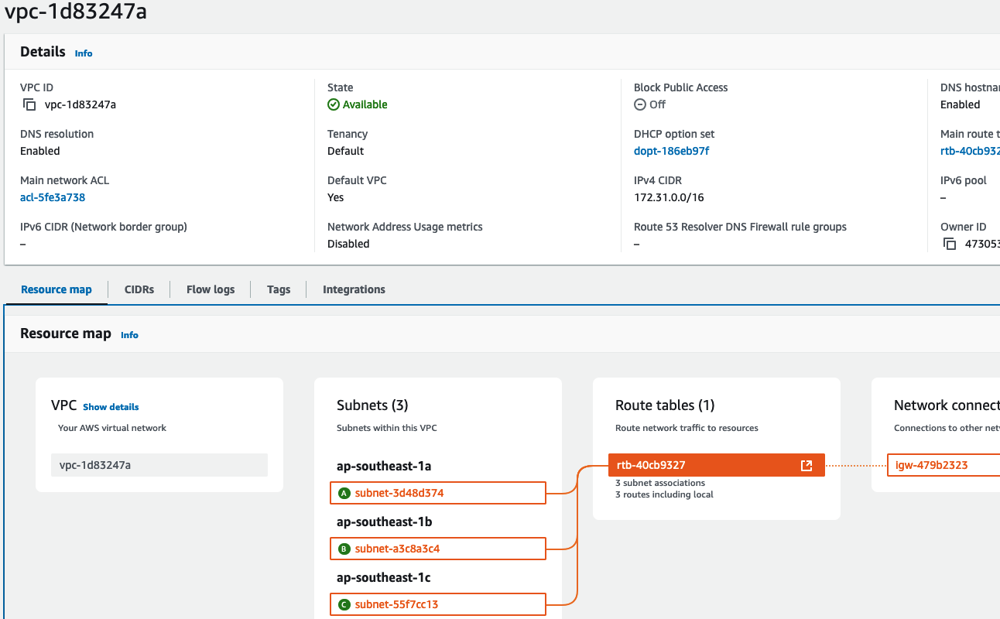

add new route to main table, associate on-premise CIDR with transit gateway created in previous steps.
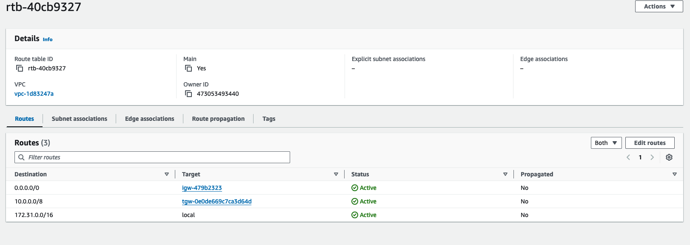

### 5. Transit Gateway Route Table

Check tgw route associates:
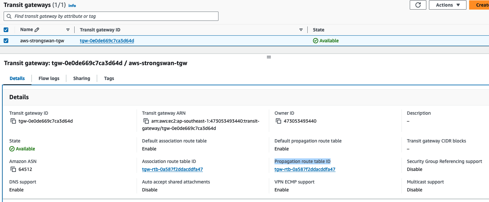

this route association should have 2 attachments, 1 is VPC, we have to add site-to-site VPN to tgw route table.

expected result:
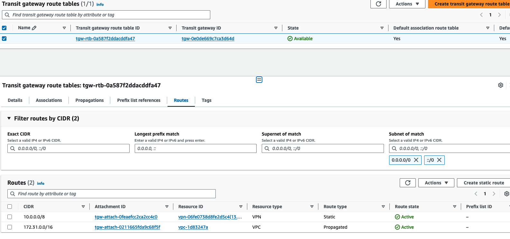

### 6. Test connectivity

Create 1 GCP VM and 1 AWS EC2 in their respective VPC, and ping:

From AWS: 
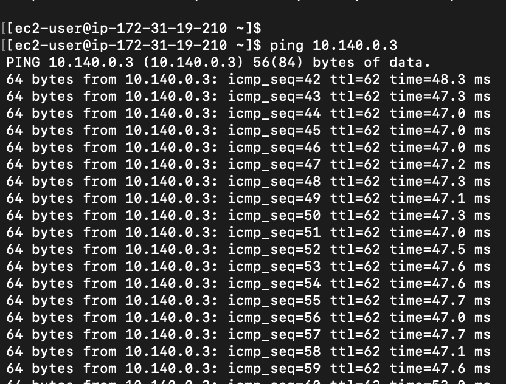

From on-premise:  
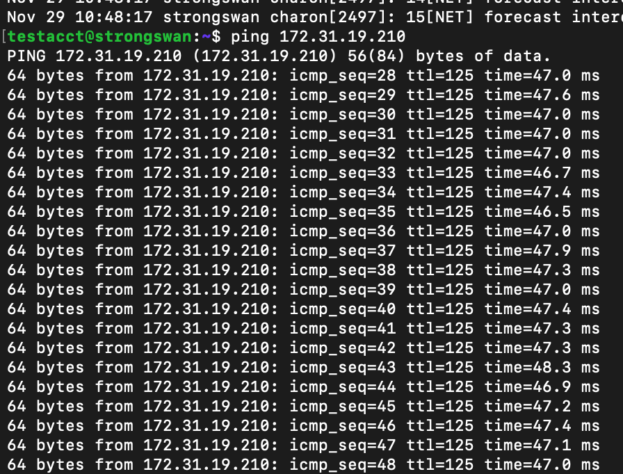