# Kubernetes Cluster Installation

As Kubernetes has been widely applied across various applications and products, I’ve grown interested in exploring this technology in-depth. Here’s what I’ve learned about Kubernetes. Let’s start with installation.

## 📋 Prerequisites

I use AWS for my studies, so the installation process may differ slightly if you’re using on-premises servers.

- AWS Account
- Minimum 2 CPUs, 4GB RAM
- **Ubuntu 22.04 LTS or above** (recommended for K8s cluster, others can be AWS Linux2023)
- **CRIO version 1.28**
- New IAM Role with the policy `AmazonEKS_CNI_Policy` attached; assign this role to the EC2 server if using AWS.

## 🏗️ Introduction

The architecture diagram below explains the Kubernetes Single control plane concept, highlighting the interactions between components. For example, a load balancer is crucial when configuring the control plane endpoint. Some experts suggest using HAProxy (for on-premises setups) or Network Load Balancers (for AWS/GCP) to distribute requests between nodes.

In addition to a load balancer, the control plane (control plane) and worker nodes can be deployed in different regions if you’re using cloud VPN, VPC peering, or a Transit Gateway. Firewall rules or Security Groups will require several ports for communication between nodes. Allowing all ports might be feasible if all nodes reside in private subnets, but ensure internet access via a NAT Gateway or Bastion server.

It’s worth noting that Kubernetes clusters are typically set up in single-master mode. Kubernetes doesn’t manage a distributed etcd (key-value store), so without a distributed database, any secondary control plane would remain idle or redundant in the cluster.

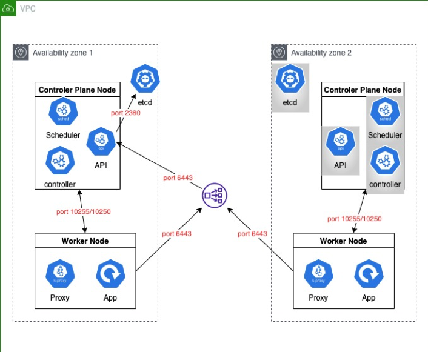

## 📊 Components and Required Ports

The control plane (control plane) maintains the cluster’s desired state, schedules container deployment, monitors cluster health, and responds to resource changes.

| **Component**       | **Port(s)**                           | **Description**                                                                                                                                                                    |
|---------------------|---------------------------------------|------------------------------------------------------------------------------------------------------------------------------------------------------------------------------------|
| **API Server**      | 6443                                  | Entry point for all Kubernetes commands (both internal and external) via RESTful requests                                                                                         |
| **Scheduler**       | 10251 (pre v1.23) <br/> 10259 (v1.23+) | Schedules workloads (pods) to cluster nodes based on resource requirements, node availability, and affinity/anti-affinity rules                                                   |
| **Controller Manager** | 10257                              | Ensures various aspects of the cluster’s desired state are maintained                                                                                                              |
| **etcd**            | 2379 (client) <br/> 2380 (peer)      | Distributed key-value store used by Kubernetes to store configuration data and state                                                                                              |

## ⚙️ Load Balancer (HAProxy)

HAProxy plays a critical role in high availability setups. While AWS and GCP network load balancers can serve this purpose, in my tests, requests sometimes stall at the AWS network load balancer. Further testing is necessary to identify the exact cause.

The load balancer is essential when setting the `control-plane-endpoint` in a Kubernetes cluster. If an IP/DNS for a load balancer is not provided, installation proceeds, but the setup won’t support high availability. This limitation occurs because the control plane’s CA certificate and self-signed x509 are tied to the control plane’s IP/hostname and can’t be reused by a secondary control plane.

### 1. HAProxy

#### a. Install package
```bash
sudo yum update
sudo yum install haproxy -y
```
#### b. Edit HAProxy Config

```bash
sudo vi /etc/haproxy/haproxy.cfg
```
add new parts below, after ‘global’ & ‘defaults’ sections:
```bash
global
…
defaults
…

frontend kubernetes
    bind <lb-node IP/DNS>:6443
    option tcplog
    mode tcp
    default_backend kubernetes-master-nodes
backend kubernetes-master-nodes
    mode tcp
    balance roundrobin
    option tcp-check
    default-server inter 10s downinter 5s rise 3 fall 2 slowstart 60s maxconn 250 maxqueue 256 weight 100
    server master-node-1 <master-node-1 IP/DNS>:6443 check
    server master-node-2 <master-node-2 IP/DNS>:6443 check
```
#### restart HAProxy:
```bash
sudo systemctl restart haproxy
```

## ⚙️ Kubernetes
### 1. Kubernetes

#### a. install kebelet, kubeadm and kubectl
```bash
sudo apt update
sudo apt install -y apt-transport-https ca-certificates curl vim git curl wget 

sudo rm /etc/apt/sources.list.d/kubernetes.list
curl -fsSL https://pkgs.k8s.io/core:/stable:/v1.28/deb/Release.key | sudo gpg --dearmor -o /etc/apt/keyrings/kubernetes-apt-keyring.gpg
echo 'deb [signed-by=/etc/apt/keyrings/kubernetes-apt-keyring.gpg] https://pkgs.k8s.io/core:/stable:/v1.28/deb/ /' | sudo tee /etc/apt/sources.list.d/kubernetes.list

sudo apt update
sudo apt install -y kubeadm=1.28.1-1.1 kubelet=1.28.1-1.1 kubectl=1.28.1-1.1
```
stop automatically upgrade kubernetes package
```bash
sudo apt-mark hold kubelet kubeadm kubectl
```
check installation
```bash
kubectl version --client && kubeadm version
```
the result should show version information of kubernetes
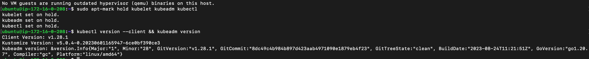

#### b. disable swap
When swap is enabled, the kernel may move inactive pages from RAM to disk, which can lead to a significant performance degradation for workloads running in containers and result in performance degradation. Also, the Linux Out Of Memory (OOM) killer may terminate processes to free up memory. This includes potentially killing important Kubernetes components, which can destabilize the entire cluster.
```bash
sudo sed -i '/ swap / s/^\(.*\)$/#\1/g' /etc/fstab

#if  ‘/swap.img’ can be fount, comment it out
sudo vim /etc/fstab
#/swap.img	none	swap	sw	0	0

sudo swapoff -a
sudo mount -a
free -h
```

#### c. check network config
```bash
# Enable kernel modules
sudo modprobe overlay
sudo modprobe br_netfilter

# Add some settings to sysctl
sudo tee /etc/sysctl.d/kubernetes.conf<<EOF
net.bridge.bridge-nf-call-ip6tables = 1
net.bridge.bridge-nf-call-iptables = 1
net.ipv4.ip_forward = 1
EOF

# Reload sysctl
sudo sysctl --system
```

#### d. install container runtime
```bash
sudo apt update
sudo apt install -y apt-transport-https ca-certificates curl gnupg2 software-properties-common

#Check Ubuntu version before export variable
export OS_VERSION=xUbuntu_22.04

#Check available version to install  https://cri-o.github.io/cri-o/
export CRIO_VERSION=1.28

curl -fsSL https://download.opensuse.org/repositories/devel:/kubic:/libcontainers:/stable/$OS_VERSION/Release.key | sudo gpg --dearmor -o /usr/share/keyrings/libcontainers-archive-keyring.gpg

curl -fsSL https://download.opensuse.org/repositories/devel:/kubic:/libcontainers:/stable:/cri-o:/$CRIO_VERSION/$OS_VERSION/Release.key | sudo gpg --dearmor -o /usr/share/keyrings/libcontainers-crio-archive-keyring.gpg

echo "deb [signed-by=/usr/share/keyrings/libcontainers-archive-keyring.gpg] https://download.opensuse.org/repositories/devel:/kubic:/libcontainers:/stable/$OS_VERSION/ /" | sudo tee /etc/apt/sources.list.d/devel:kubic:libcontainers:stable.list

echo "deb [signed-by=/usr/share/keyrings/libcontainers-crio-archive-keyring.gpg] https://download.opensuse.org/repositories/devel:/kubic:/libcontainers:/stable:/cri-o:/$CRIO_VERSION/$OS_VERSION/ /" | sudo tee /etc/apt/sources.list.d/devel:kubic:libcontainers:stable:cri-o:$CRIO_VERSION.list

sudo apt update
sudo apt install -y cri-o cri-o-runc
```

```bash
sudo systemctl daemon-reload
sudo systemctl enable crio
sudo systemctl start crio

sudo systemctl status crio
```
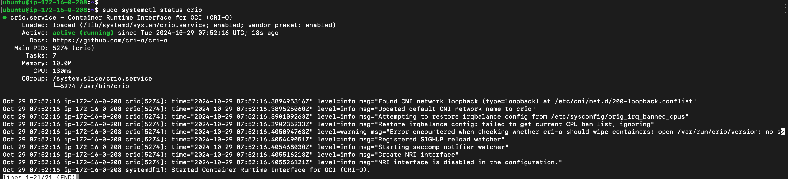

#### e. verity CRIO installation
```bash
sudo apt install -y cri-tools
sudo crictl --runtime-endpoint unix:///var/run/crio/crio.sock version
```
<!-- 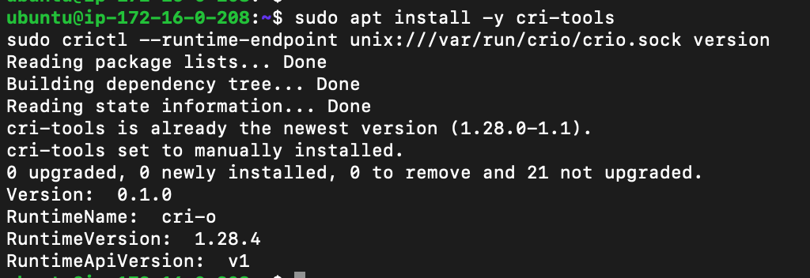 -->


```bash
sudo crictl info
```
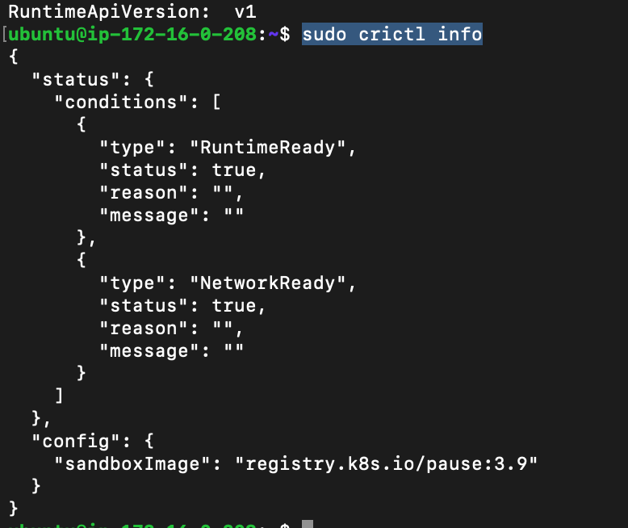

#### f. update CRIO subnet
```bash
sudo modprobe overlay
sudo modprobe br_netfilter

sudo tee /etc/sysctl.d/kubernetes.conf<<EOF
net.bridge.bridge-nf-call-ip6tables = 1
net.bridge.bridge-nf-call-iptables = 1
net.ipv4.ip_forward = 1
EOF

sudo sysctl -p
sudo sysctl --system
```
Change {CIDR}below:
```bash
#if cannot find 100-crio-bridge.conf, try 100-crio-bridge.conflist
sudo sed -i 's/10.85.0.0/{CIDR}/g' /etc/cni/net.d/100-crio-bridge.conf
sudo sed -i 's/10.85.0.0/{CIDR}/g' /etc/cni/net.d/100-crio-bridge.conflist

#e.g.
sudo sed -i 's/10.85.0.0/172.16.0.0/g' /etc/cni/net.d/100-crio-bridge.conf
sudo sed -i 's/10.85.0.0/172.16.0.0/g' /etc/cni/net.d/100-crio-bridge.conflist
```
before changing: <br/>
<!-- 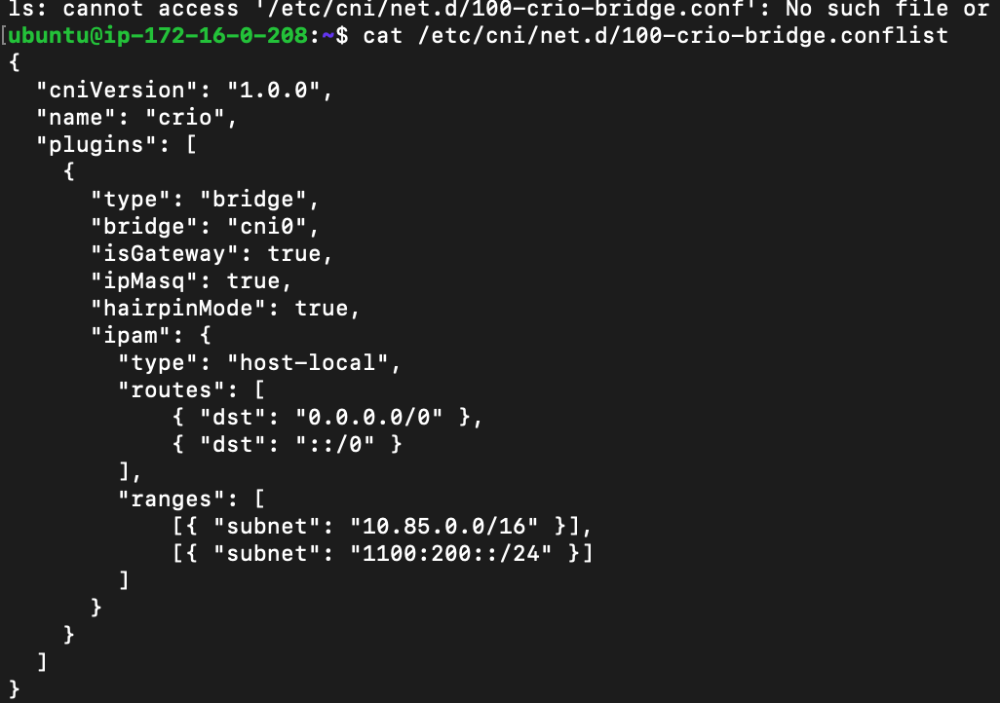 -->
<br/>
after changing:<br/>
<!-- 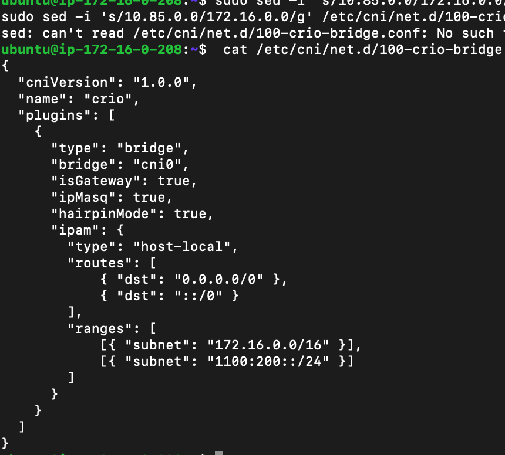 -->


restart CRIO
```bash
sudo systemctl daemon-reload
sudo systemctl restart crio
sudo systemctl enable crio
sudo systemctl status crio
```

### 2. Initialise 1st control plane
#### a. verify br_netfilter
need to check module br_netfilter is loaded, its esscential to pod-to-pod communication

```bash
lsmod | grep br_netfilter
```
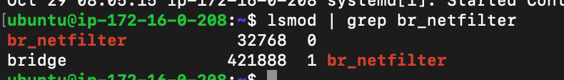

#### b. enable kubelet
```bash
sudo systemctl enable kubelet
sudo kubeadm config images pull
```
If you have multiple CRI sockets, please use --cri-socket to select one (Optional):
```bash
sudo kubeadm config images pull --cri-socket unix:///var/run/crio/crio.sock
```

#### c. initialise kubeadm
replace loadbalancer ip and CIDR below, in this document, HAProxy is the loadbalancer:
```bash
sudo kubeadm init --control-plane-endpoint {master-node-1 IP/DNS}:6443 --upload-certs --pod-network-cidr={CIDR} --cri-socket unix:///var/run/crio/crio.sock

e.g.
sudo kubeadm init --control-plane-endpoint 172.16.0.208:6443 --upload-certs --pod-network-cidr=172.16.0.0/16 --cri-socket unix:///var/run/crio/crio.sock
```
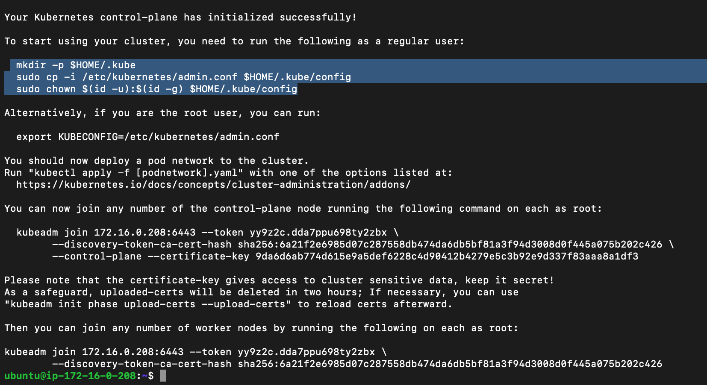

from the result above, more instruction is given, 2 cmd should be found, 1 is to add other control planes, another is to add worker nodes

#### d. change permission
```bash
mkdir -p $HOME/.kube
sudo cp -i /etc/kubernetes/admin.conf $HOME/.kube/config
sudo chown $(id -u):$(id -g) $HOME/.kube/config
```
verify cluster
```bash
kubectl cluster-info
```
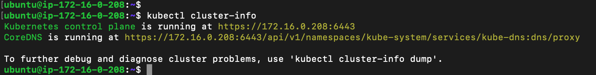

#### e. install network plugin on control planes <br/>
https://kubernetes.io/docs/concepts/cluster-administration/addons/ <br/>

this link is good resource to explain all kind of plugins, I use Calico for my study
```bash
kubectl apply -f https://docs.projectcalico.org/manifests/calico.yaml
```

#### f. verify control planes
```bash
watch kubectl get pods --all-namespaces
```
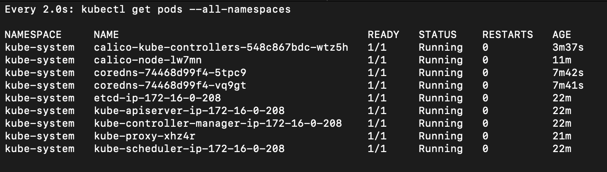

if here shows error, e.g. CrashLoopBackOff, check logs and debug:
```bash
kubectl logs -n kube-system calico-kube-controllers-658d97c59c-mnz8g
```
or can run restart this deployment, for example:
```bash
kubectl rollout restart deployment -n kube-system coredns
kubectl rollout restart deployment -n kube-system calico-kube-controllers
```

### 3. Install other control planes
If 1st control plane is installed successfully, command is shown to add more control planes. Before adding new control planes to cluster, we still need to go through control plane installation and container runtime, then enable kubelet:

#### a. verify br_netfilter
need to check module br_netfilter is loaded, its esscential to pod-to-pod communication

```bash
lsmod | grep br_netfilter
```


#### b. enable kubelet
```bash
sudo systemctl enable kubelet
sudo kubeadm config images pull
```
If you have multiple CRI sockets, please use --cri-socket to select one (Optional):
```bash
sudo kubeadm config images pull --cri-socket unix:///var/run/crio/crio.sock
```

#### c. add 2nd or more control plane to cluster
after 1st control plane is initialised, the cmd to add other ctrl planes show as below:

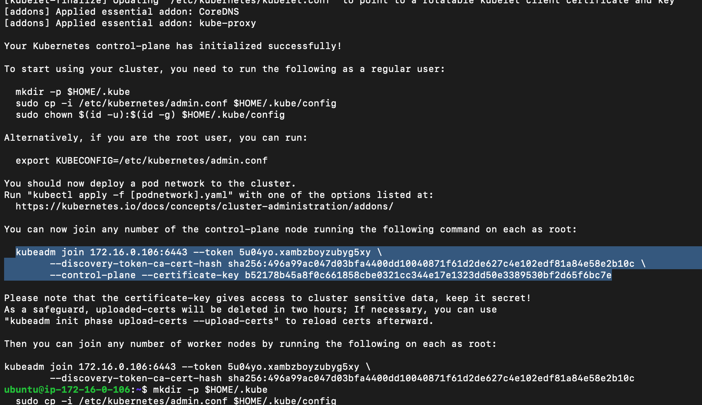

```bash
e.g. 
sudo kubeadm join 172.16.0.106:6443 --token 5u04yo.xambzboyzubyg5xy \
	--discovery-token-ca-cert-hash sha256:496a99ac047d03bfa4400dd10040871f61d2de627c4e102edf81a84e58e2b10c \
	--control-plane --certificate-key b52178b45a8f0c661858cbe0321cc344e17e1323dd50e3389530bf2d65f6bc7e
```

2nd control plane is added:
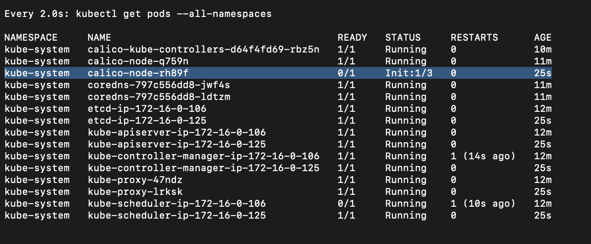

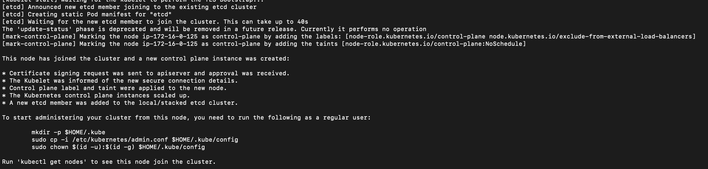
```bash
kubectl get nodes
```
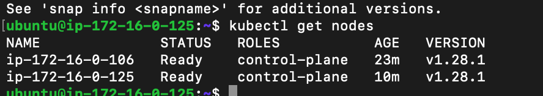
after 2nd ctrl plane is initialised, set up kubectl home directory


### 4. Install worker node

#### a. prepare work node
If master node is installed successfully, worker nodes can be added anytime. Before adding new worker nodes to cluster, we still need to go through kubernetes node installation and container runtime, then enable kubelet:
```bash
lsmod | grep br_netfilter
```


#### b. enable kubelet
```bash
sudo systemctl enable kubelet
sudo kubeadm config images pull
```
If you have multiple CRI sockets, please use --cri-socket to select one (Optional):
```bash
sudo kubeadm config images pull --cri-socket unix:///var/run/crio/crio.sock
```

#### c. add work node
go back to the screenshot:

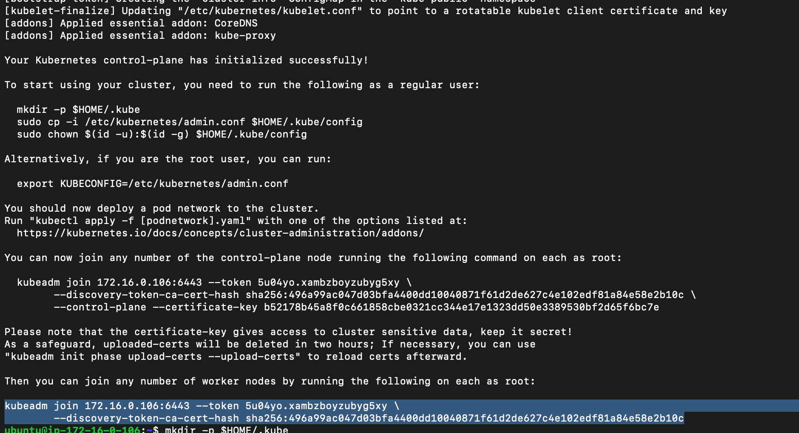

if this cmd is not saved or forgot, run this to find out:
```bash
kubeadm token create --print-join-command
```
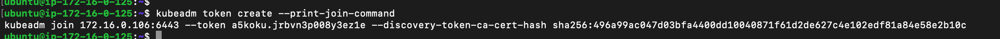

if you do it successfully:
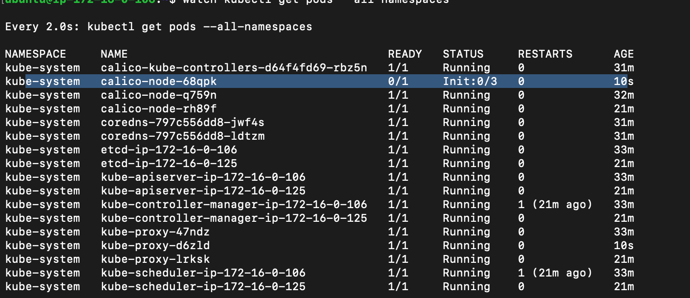
check cluster status from control plane:
```bash
kubectl get nodes
```
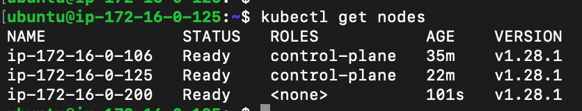

### 5. Change Resolved
In kubernetes clusters, DNS resolution typically happens through the CoreDNS or kube-dns service running within the cluster, which allows pods to communicate with each other using DNS. However, the address 127.0.0.53 is often used by systemd-resolved on Linux systems as a local DNS resolver. This may lead to confusion if you're trying to access external domains.

we have to change system resolved and add google dns in:
```bash
sudo systemctl stop systemd-resolved
sudo vi /etc/systemd/resolved.conf
```
add google dns:
```bash
[Resolve]
DNS=8.8.8.8 8.8.4.4
```
<!-- 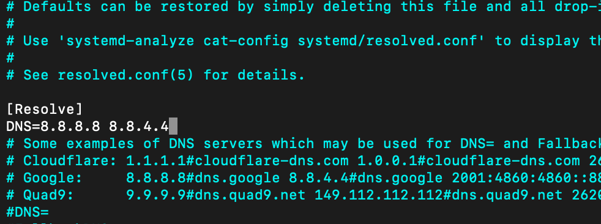 -->
<br/>
restart system resolved:
```bash
sudo systemctl restart systemd-resolved
sudo reboot
```
Test:
```bash
nslookup raw.githubusercontent.com
```
<!-- 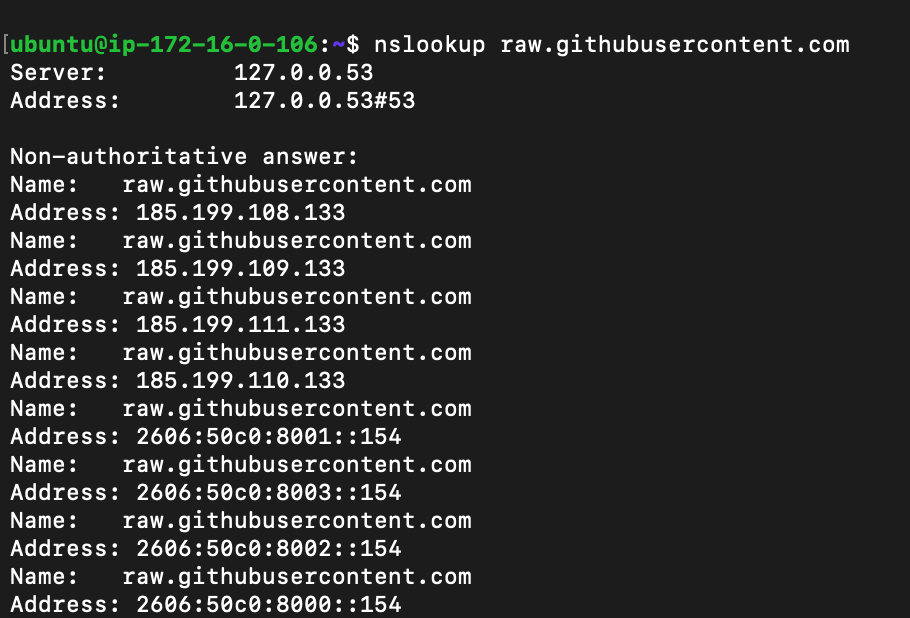 -->
<br/>

### 6. Test work node
Let's us install nginx on control planes
#### a. install helm
```bash
curl https://baltocdn.com/helm/signing.asc | sudo apt-key add -
sudo apt-get install apt-transport-https --yes

curl -fsSL -o helm.tar.gz https://get.helm.sh/helm-v3.11.1-linux-amd64.tar.gz
tar -zxvf helm.tar.gz
sudo mv linux-amd64/helm /usr/local/bin/helm

helm repo add kong https://charts.konghq.com
helm repo update
helm repo add ingress-nginx https://kubernetes.github.io/ingress-nginx
helm repo update
```
#### b. install nginx
```bash
kubectl create namespace ingress-nginx 
helm repo add ingress-nginx https://kubernetes.github.io/ingress-nginx
helm install nginx-ingress ingress-nginx/ingress-nginx --namespace ingress-nginx
```