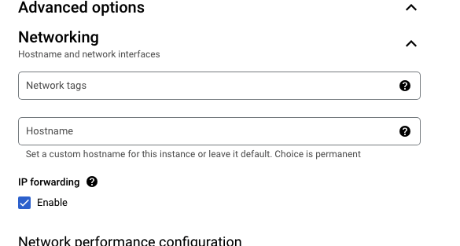
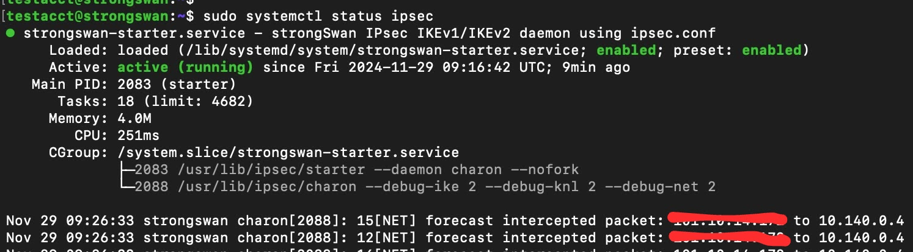
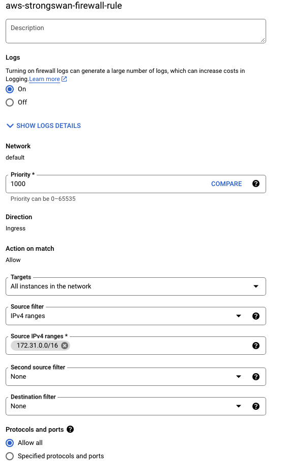
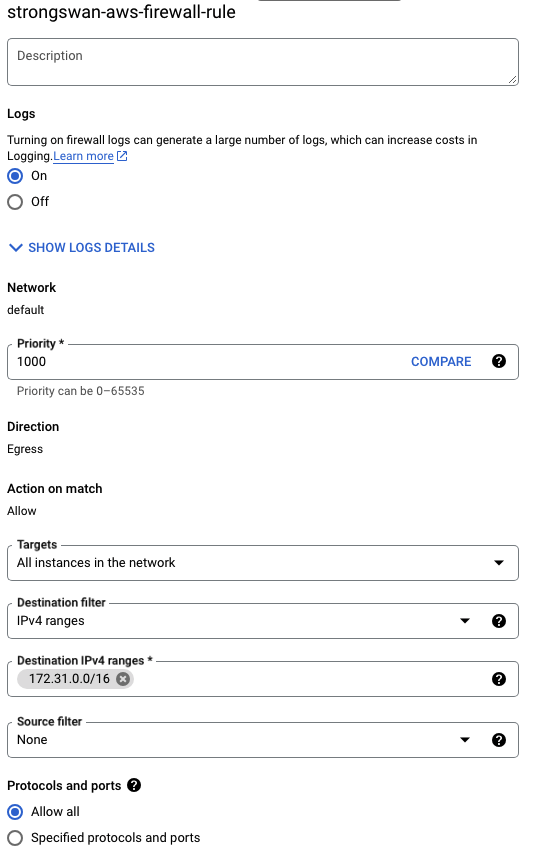
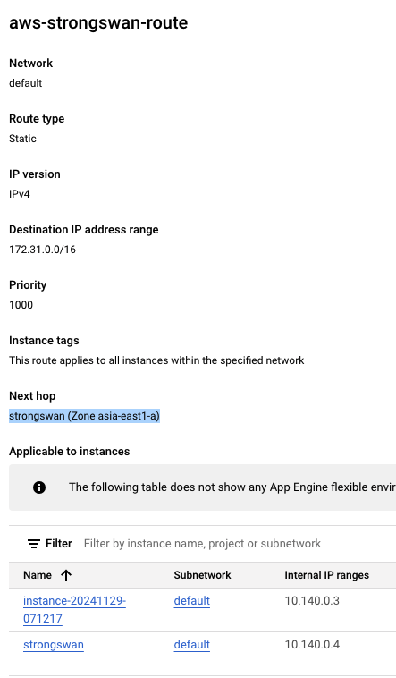

# Strongswan on GCP

I know we don't need to install 3rd-party vpn server on gcp VM; gcp has Cloud VPN service, but sometimes I need gcp vm or aws ec2 to simulate bugs. This document is to use gcp and strongswan to simulate on-premise vpn.  


## 📋 Prerequisites

- gcp VM e2-medium
- Debian GNU/Linux 12 (bookworm)

## ⚙️ Preparation

### 1. create GCP VM
When we create vm, need to check 1 option network config: 'IP forwarding'. This property seems not able to update after creation.



## 🛠️ StrongSwan

### 1. installation

```bash 
sudo apt update
sudo apt install strongswan strongswan-pki                
```

### 2. change config files

#### a. /etc/ipsec.conf
```bash
sudo vi /etc/ipsec.conf
```
and add new set of config below after the comment:
```properties
conn aws-vpn
    authby=secret                      # Use a shared secret for authentication
    auto=start                         # Automatically start connection on boot
    rekey=yes
    keyexchange=ike                    # Use IKEv2 (default for strongSwan)
    ike=aes256-sha1-modp1024           # Phase 1 encryption
    esp=aes256-sha1                    # Phase 2 encryption
    ikelifetime=8h                     # Phase 1 key lifetime
    lifetime=1h                        # Phase 2 key lifetime
    keyingtries=%forever               # Retry forever to establish connection
    left=%any                          # Local interface (use %any for dynamic IP)
    leftid=${GCP Strongswan server ip} # Public IP or domain of your GCP VM
    leftsubnet=${GCP VPC/Subnet CIDR}  # Local subnet behind the GCP VM
    right=${VPN server public IP}      # Remote VPN gateway (AWS VPN endpoint)
    rightid=%any                       # Accept any identity from AWS
    rightsubnet=${destination CIDR}    # Subnet behind the AWS VPN
    dpdaction=restart                  # Restart connection if DPD fails
    dpddelay=30s                       # Delay between DPD checks
    dpdtimeout=120s                    # Timeout for DPD responses
```

#### b. /etc/ipsec.secrets
```bash
sudo vi /etc/ipsec.secrets
```
and add PSK secret key in:
```
<GCP_VM_Public_IP> <DESTINATION_VPN_IP> : PSK "your-shared-secret"
```

#### c. Enable Forwarding on GCP VM
```bash
sudo vi /etc/sysctl.conf
```
add config below:
```
net.ipv4.ip_forward=1
net.ipv6.conf.all.forwarding=1
```
Apply changes:
```bash
sudo sysctl -p
```

#### d. Add forwarding rules to your iptables
```bash
sudo iptables -A FORWARD -s <Your_Local_Subnet> -d <destination CIDR> -j ACCEPT
sudo iptables -A FORWARD -s <destination CIDR> -d <Your_Local_Subnet> -j ACCEPT
```

### 3. restart IPSec

```bash 
sudo systemctl restart ipsec
sudo systemctl status ipsec
```
expected result:


### 4. Firewall rule

Open GCP Firewall rule, add ingress and egress respectively:

ingress:<br/>


egress:<br/>


### 4. Route table

go to GCP 'VPC Network' -> 'Routes' -> tab 'Route Management', and create a new route on your VPC, in my case, I use 'default':<br/>

'Next hop' need to choose the strongswan vm we created in previous steps.

now you can go head to config VPN server in peer domain. 

