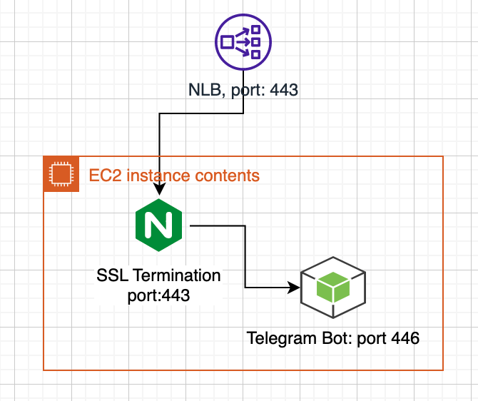
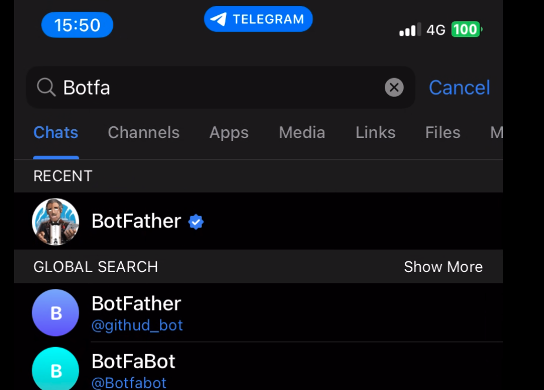
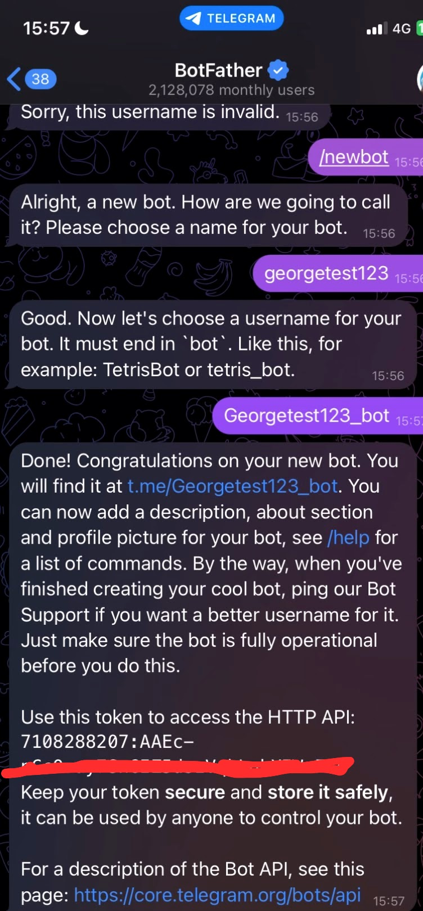
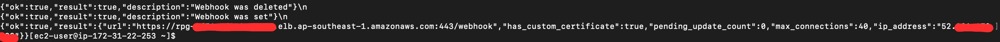
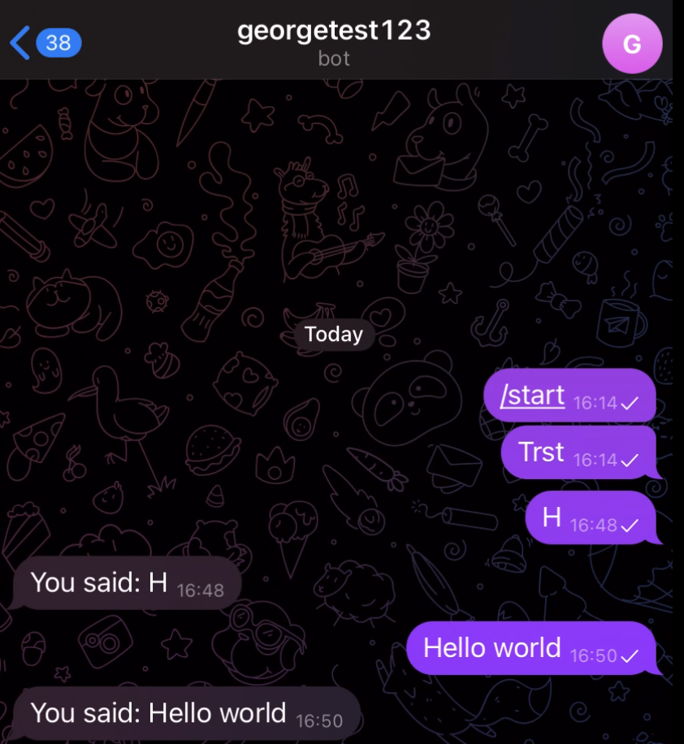

# Telegram Bot with WebHook

Would like to develop a simple bot to help my church services. The idea is to put worship weekly, published articles and hymn all together. 

## 📋 Prerequisites

- Minimum 1 CPUs, 2GB RAM
- AWS Linux2023
- nodejs v18.20 or above
- npm v10.7 or above
- TLS 1.2 or above (with domain name)
- <a href='https://core.telegram.org/bots/webhooks'>Telegram webhook document</a>


## 🏗️ Introduction

My idea about this chatbot is that using network loadbalancer as entry point receives any message from Telegram through webhook; using Nginx terminates SSL connection, and forward request to my bot written in nodejs.



There are something need to know:
- self-signed certificate works, but TLS/SSL must be 1.2+, and have to register domain name in CN or SAN (in my case, I use AWS NLB dummy domain name)
- Telegram webhook only transfers messages to 4 ports: 80, 88, 443, 8443
- can config firewall (in my case, I use AWS security group) to constrain message-transferring from 149.154.160.0/20 and 91.108.4.0/22, if security is your concern

## ⚙️ Instruction 

### Generate Self-Signed cert

```bash
 openssl req -new -newkey rsa:2048 -days 365 -nodes -x509  -subj "/CN=rpg-XXXXX.elb.ap-southeast-1.amazonaws.com" -keyout rpg-XXXX.elb.ap-southeast-1.amazonaws.com.key -out rpg-XXXX.elb.ap-southeast-1.amazonaws.com.crt
```

### Config Nginx

```bash
vi /etc/nginx/conf.d/telegrambot.conf 
```
the config looks like:

```bash
server {
    listen 443 ssl;
    server_name rpg-7f76ccf078caba5f.elb.ap-southeast-1.amazonaws.com;

    ssl_certificate "/home/ec2-user/rpg-7f76ccf078caba5f.elb.ap-southeast-1.amazonaws.com.crt";
    ssl_certificate_key "/home/ec2-user/rpg-7f76ccf078caba5f.elb.ap-southeast-1.amazonaws.com.key";
    ssl_protocols TLSv1.2 TLSv1.3;
    ssl_prefer_server_ciphers on;
    ssl_ciphers 'EECDH+AESGCM:EDH+AESGCM:AES256+EECDH:AES256+EDH';

    location / {
        proxy_pass http://localhost:446;
        proxy_http_version 1.1;
        proxy_set_header Upgrade $http_upgrade;
        proxy_set_header Connection 'upgrade';
        proxy_set_header Host $host;
        proxy_cache_bypass $http_upgrade;
    }
}
```
```bash
sudo systemctl 
```

### Create a Telegram Bot

a. BotFather, open Telegram app, and search botfather



b. create new bot, follow the instruction below, have to enter bot name and username



finally, bot token is generated, it looks like '710XXXX207:AAEc-XXXXXXXXXzVqhLqkXIWmFcc'. Keep this token in a safe place!!

Also, after creating bot, botFather also provide hyperlink to find the bot you setup.

### Register Webhook URL

Setup 3 variables below, replace with correct value. 

```bash
export TELEGRAM_BOT_TOKEN=7108XXXX07:AAEc-nCcOXXXXXXXXXXdszVqhLqkXIWmFcc
export WEBHOOK_HOST=https://rpg-XXXXX.elb.ap-southeast-1.amazonaws.com:443
export WEBHOOK_PATH=webhook

echo $TELEGRAM_BOT_TOKEN;
echo $WEBHOOK_HOST;
echo $WEBHOOK_PATH;

curl "https://api.telegram.org/bot$TELEGRAM_BOT_TOKEN/deleteWebhook";
echo "\n"

curl -F "url=$WEBHOOK_HOST/$WEBHOOK_PATH" -F "certificate=@/home/ec2-user/rpg-XXXXX.elb.ap-southeast-1.amazonaws.com.crt" "https://api.telegram.org/bot$TELEGRAM_BOT_TOKEN/setWebhook";
echo "\n"
curl "https://api.telegram.org/bot$TELEGRAM_BOT_TOKEN/getWebhookInfo";
```
expected result:


after executing commands above, sometimes we may need to wait minutes, then run nodejs code


### Run bot
```bash
sudo nodejs bot.js
```



